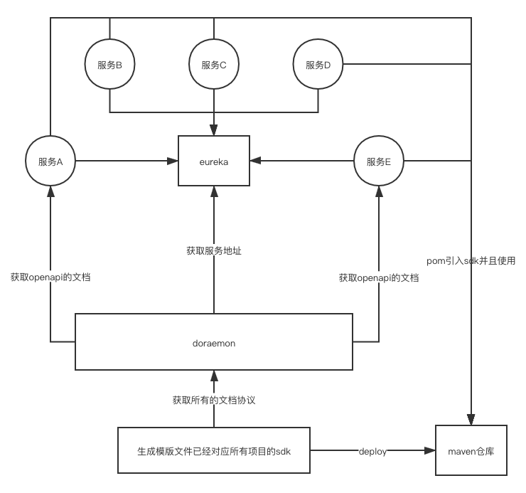

# 如何在中大型规模的微服务架构（spring-cloud）中优雅的编写客户端sdk

## 说明

目前惠农网服务端的应用是基于`spring-cloud`的体系构建的，
这个项目主要是用于生成服务端`feign-sdk`的项目，节省了近一百个服务调用其他服务的接口定义和bean的定义，大大提高了接入内部服务的效率，也大大减少了代码的编写。

## 背景

随着公司的业务发展，微服务越来越多，从几个微服务，发展到几十个，到现在的一百多个微服务，服务之间的调用越来越频繁

每增加一个新的服务，可能都要调用其他的十来个服务，每次都需要定义对应的feign的client和对应的failback的处理方式和request/response的对象，重复的代码很多，也很浪费时间。

## 如何解决问题重复定义的问题？

针对这个问题，我们翻遍了互联网上的各种资源，有没有找到一个特别合适的方法。

所以没办法，那只能根据我们自己的实际情况触发。采用合适的方式来开发适合自己的客户端sdk

经过内部的讨论，总结出了三个派别的意见

### 方式一

不做任何处理，继续还是按现在的模式，毕竟已经存在这么久了，大家都适应了这种工作方式，也没有觉得特别别扭。

### 存在的问题

- 多个项目重复定义相同的bean
- 重复开发一样的代码，浪费工作时间
- 服务端提供的说明文档不清晰，需要多方进行沟通

虽然这个方式，没有任何改变，但是开发者工作量还是有一点大，所以我们既然要讨论方案，就不可能一成不变，所以我们要继续探索。

### 方式二

#### 思路
每个服务定义一个api项目，每个服务提供者把接口的bean和feign-client写入到里面，然后做成jar包。
deploy到maven，使用方直接依赖jar包，并且使用jar中间的bean和client来进行调用。

#### 优势
- 客户端只需要引入对应服务的api项目，并且直接使用就可以了，减少了定义的地方

#### 步骤

- 每个微服务定义一个api项目
- 把接口bean定义在这个api项目里面
- 编写所有接口的client的定义
- 生成jar包，然后进行deploy到仓库
- 其他服务在使用的时候进行依赖写入

#### 存在的问题

- 对于已经存在大几十个服务的情况下，要补充每个服务的api项目，是一个工程量巨大的过程
- 而且每次更新和发布都要依赖开发者进行开发。并且与现有项目进行了深度耦合和绑定，不利于扩展
- 通过约定的方式，是没有统一的标准的限定的，每个人代码都需要检查
- 对于新人，要进行对应的培训，沟通成本很大
- 大部分项目都要依赖十几个服务，需要引入十几个依赖，依赖项目太多，不好进行管控

这个方法是网上的主流方法，但是针对以上的问题，感觉到明显开发和维护的成本大于带来的便利，最终还是放弃了这个实现方法。

### 方式三

#### 思路：

学习`openapi-generator`项目的处理方式，通过 mustache + swagger + openapi3 的标准来生成feign和request/response的对象

#### 优势

- 可以通过旁路来进行生成，不依赖项目的发布和修改
- 统一标准，自动化生成，不再需要人肉去进行生成，提高生成效率
- 可以检查`bean`定义的规范，避免一些人用`map`类型进行定义
- 代码更新之后，重新发布也快速和方便，维护也进行统一
- 灵活方便，要提供的功能只要是`openapi3`协议支持的，都可以通过标准协议来生成

#### 步骤：

- 通过`eureka`可以拿到所有服务的地址
- 通过统一的路径`/v3/api-docs`来获取标准的`openapi3`的文档协议
- 通过指定好的`mustache`模版，根据服务名称来生成对应的模块和包，并且包含了对应的`feign-client`代码
- 统一项目进行deploy
- 使用放只要引入这一个项目， 按照服务名称就可以找到对应的接口了

#### 可能存在的问题

- 多次发布定义的bean有改变，可能会导致编译时期出现错误。如果遇到问题，应该在编译期间就会出错，并不会对线上造成任何问题， 也可以进行修改之后在重新编译发布

这种方式，从利弊分析，优势大于存在的问题，而且`openapi`官方也是采用的这种方式，生成了各种语言的sdk，
经过讨论，最终决定，通过这种方式来进行技术落地

在使用这个项目之后，客户端再也不用各种拷贝复杂的bean了，也再也不用重复的各种feign的定义了，感觉真的是好极了。

## 后续目标

- 既然服务端的可以生成，那么后续可以考虑为所有的前端提供对应的模版，也方便前端的接入成本。
- 可以通过指定服务，指定接口来增量生成代码。

## 项目整体流程

## 项目的结构
`doraemon-generator` 这个项目用于在eureka上面获取配置信息，并且通过模版来生成代码，并且代码生成到了`doraemon-api`项目里面
`doraemon-api` 这个项目用于进行deploy，给其他服务进行引用
`doraemon` 这个项目是整体的父项目，对子项目进行管理

## 项目使用方式

- 编译整个项目 mvn clean package
- 通过脚本来指定对应的服务来生成 `doreamon-api` 项目（如果不指定，则生成所有的项目） 
- deploy生成的 `doreamon-api` 项目到仓库

## 在落地项目过程中遇到的问题

- 因为我们整体项目都是基于`springboot`和`springcloud`的，又因为整个`spring`的框架有众多注解，要生成接口定义和参数定义， 要使用到众多的判断，完全自己来利用`mustache`写
会有巨大的工作量，所以我们主要是基于`openapi-generator`包里面的`SpringCodegen`和`DefaultGenerator`作为基础类，并且使用里面的`mustache`变量，定义自己的模版，大大减少了
编写代码的成本

- 利用现在注册到`eureka`里面的`metadata`信息来判断，哪些服务是使用了`openapi3`的协议，来完全区分`openapi2`和`openapi3`的差异性。

- 利用`OpenAPIV3Parser`方法来直接解析`openapi3`的协议，来简化整体解析流程，并且配合内置的`mustache`变量来进行模版赋值

- 把项目分成了两个模块, `doreamon-generator`是用于生成项目的代码，这一个子项目不需要进行deploy, `doreamon-api`模块只生成给其他项目使用的jar，减少生成的sdk的jar包的大小

- 项目可以根据服务名称来指定获取信息和生成代码，有利于单独的重新生成的发布jar

## 最后

这个项目也是 `惠农网` 开源的第一个开源文档和开源代码，希望这个思路有助于中等规模的公司在落地微服务的过程中少走一点弯路。

